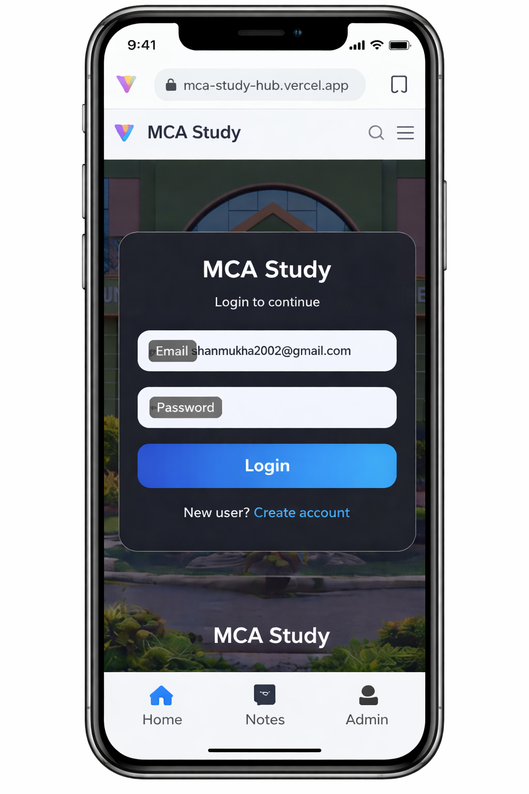
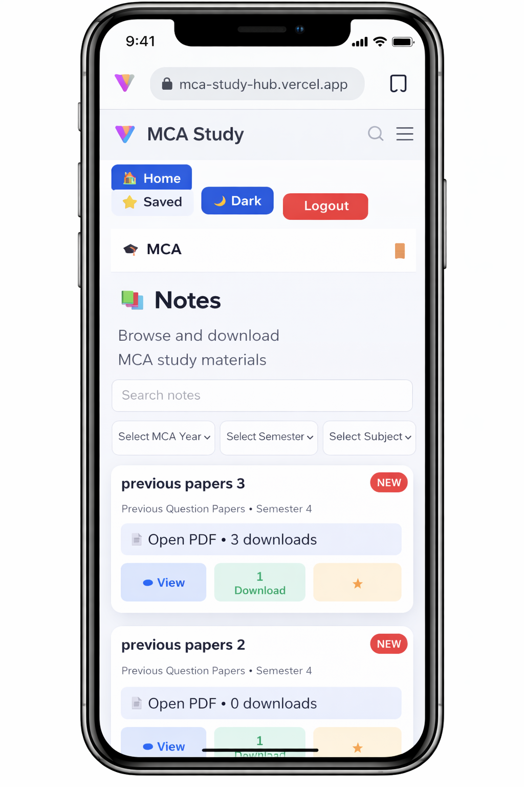
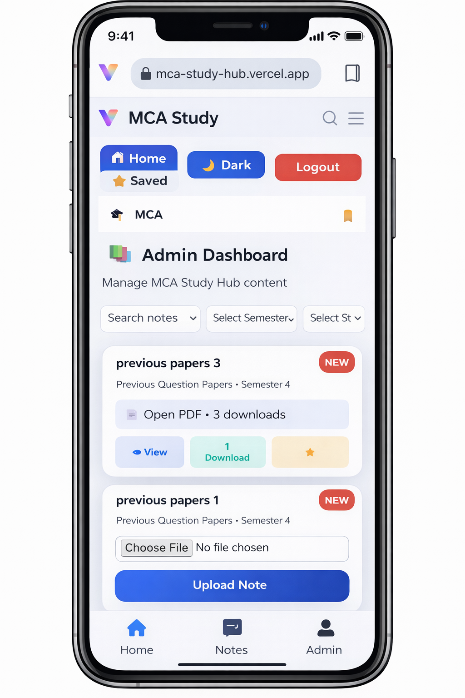

<p align="center">
  
</p>

# 🎓 MCA Study Hub  
### 🚀 Notes & Previous Year Papers Platform  
**Full-Stack Web Application | React • Django REST • Supabase**

<p align="center">
  <b>
    MCA Study Hub is a modern, secure, and responsive academic platform  
    for MCA students to access notes and previous year question papers easily.
  </b>
</p>

<p align="center">
  
  
  
  
  
</p>

---

## 📑 Table of Contents

- [Live Demo](#-live-demo)
- [About Project](#-about-mca-study-hub)
- [Features](#-features)
- [Screenshots](#-screenshots)
- [Tech Stack](#-tech-stack)
- [Security](#-security--authentication)
- [Project Structure](#-project-structure)
- [Environment Variables](#-environment-variables)
- [Installation](#-installation--setup)
- [Future Enhancements](#-future-enhancements)
- [College Project Info](#-college-project-information)
- [Resume Description](#-resume-ready-description)
- [Contributing](#-contributing)
- [License](#-license)

---

## 🌐 Live Demo

- 🔗 **Frontend:** https://mca-study-hub.vercel.app  
- 🛠 **Backend:** Django REST API (Render)

---

## 📌 About MCA Study Hub

**MCA Study Hub** is a **full-stack academic management system** built for **MCA students**.

Students can:
- 📘 Access subject-wise notes
- 📄 Download previous year question papers
- ⭐ Bookmark important study materials

Admins can:
- 🗂 Manage academic structure
- ⬆ Upload and manage PDFs securely

This project demonstrates **real-world full-stack development**,  
**secure authentication**, and **cloud-based file storage**.

---

## ✨ Features

### 👨‍🎓 Student Features
- 🔐 Secure login & logout (JWT)
- 📚 Notes organized by **Year → Semester → Subject**
- 🔍 Real-time search
- 📄 View PDFs in browser
- ⬇ Download PDFs
- ⭐ Bookmark notes
- 📊 Download count tracking
- 🌙 Dark mode / ☀ Light mode
- 📱 Fully responsive design

---

### 👨‍💼 Admin Features
- 🔐 Admin-only protected dashboard
- ➕ Upload PDF notes
- 🗂 Manage:
  - MCA Years
  - Semesters
  - Subjects
  - Notes
- ✏ Edit notes
- ❌ Delete notes
- 📊 Auto-increment download count
- ☁ Secure PDF storage using Supabase

---

## 🖼 Screenshots

> Replace these with real screenshots later

### 🔐 Login Page


### 📘 Notes Page


### 🛠 Admin Dashboard


### ⬆ Upload Notes


---

## 🧱 Tech Stack

### 🎨 Frontend
- React (Vite)
- React Router DOM
- Axios
- Custom CSS
- Dark / Light Theme
- Responsive UI

### 🧠 Backend
- Django
- Django REST Framework
- JWT Authentication
- MySQL (Aiven)
- Role-Based Permissions

### ☁ Storage
- Supabase Storage
- Secure PDF Uploads
- Public File URLs

### 🚀 Deployment
- Frontend → **Vercel**
- Backend → **Render**

---

## 🔐 Security & Authentication

- JWT Access & Refresh Tokens
- Protected Routes
- Admin-only APIs
- Secure Logout
- CORS Enabled

---

## 📂 Project Structure

mca-study-hub/
├── frontend/
│   ├── pages/
│   ├── components/
│   ├── routes/
│   ├── api/
│   ├── utils/
│   └── styles/
│
├── backend/
│   ├── accounts/
│   ├── notes/
│   ├── settings.py
│   └── urls.py


---

## ⚙ Environment  Variables 

### Frontend (`.env`)
VITE_API_BASE_URL=https://your-backend-url/api
VITE_SUPABASE_URL=https://your-project.supabase.co
VITE_SUPABASE_ANON_KEY=your_key


## Backend (.env)

SECRET_KEY=your_secret_key
DEBUG=False
DATABASE_URL=your_database_url


## Installation & Setup Frontend

npm install
npm run dev

## Backend
pip install -r requirements.txt
python manage.py migrate
python manage.py runserver


## 📈 Future Enhancements
🔍 Full-text PDF search
📊 Admin analytics dashboard
🧾 PDF preview thumbnails
🔔 Notifications
📱 Progressive Web App (PWA)


## 🎓 College Project Information
Project Title: MCA Study Hub
Domain: Full-Stack Web Development
Frontend: React
Backend: Django REST Framework
Database: MySQL
Storage: Supabase
Authentication: JWT

## 💼 Resume-Ready Description
MCA Study Hub | Full-Stack Web Application

Developed a role-based academic notes platform using React and Django REST
Implemented secure JWT authentication
Integrated Supabase cloud storage for PDF handling
Designed a responsive UI with dark and light mode
Deployed frontend on Vercel and backend on Render


## ⭐ Contributing
Contributions are welcome!
Feel free to fork the repository, open issues, or submit pull requests.

## 📄 License

This project is licensed under the MIT License.

<p align="center"> <b>⭐ If you like this project, don’t forget to star the repository!</b> </p> <p align="center"> Built with ❤️ for MCA students </p> ```